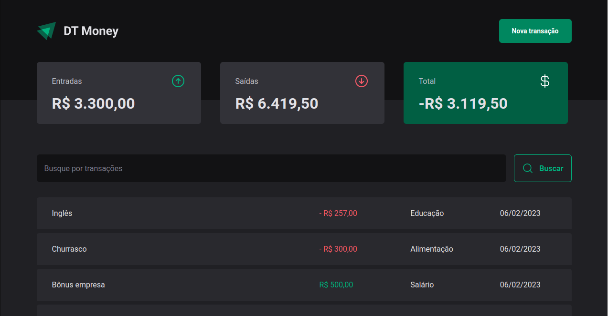
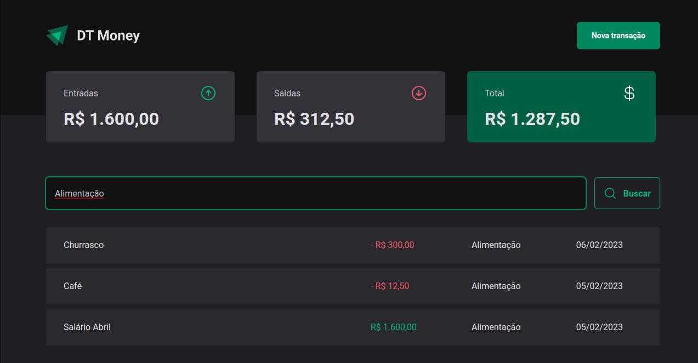
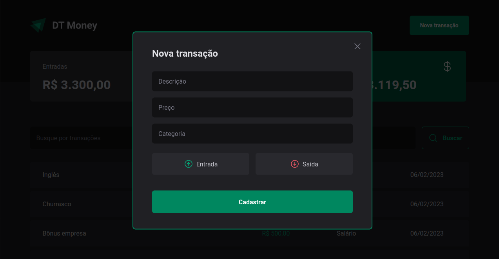
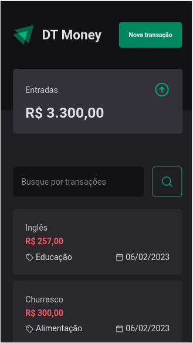

### Projeto 03 - Módulo 03 - Trilha ReactJS Ignite 2022/2023
### ***DT-Money***
#### Sobre o projeto:
 * DT-Money é um site que tem como objetivo facilitar a gestão de dinheiro tanto de entradas quanto de saídas, focando em API com JSON Server, performace e Context API

### Principais tecnologias usadas no desenvolvimento:

* TypeScript
* ReactJS(Vite)
* react-hook-form
* JSON Server
* styled-components

### Bibliotecas em destaque:

* zod
* JSON Server
* use-context-selector

### API usada:
#### Front-end:
* JSON Server (Biblioteca para criação de uma Full Fake API)

### Passo-a-passo para rodar a aplicação:
1. Entre na pasta dt-money;
2. use o comando: ***yarn*** ou ***npm install/i*** para instalar os pacotes;
3. use o comando: ***yarn dev*** ou ***npm run dev*** para rodar a aplicação.